# http-query-method-demo

> A beginner-friendly Python demo that explains the difference between **HTTP GET**, **HTTP POST** (as a search workaround), and the new **HTTP QUERY** method from [RFC 10008](https://datatracker.ietf.org/doc/html/rfc10008).

Zero external dependencies. Runs with a single `python app.py`.

---

## 📁 Folder Structure

```
http-query-method-demo/
├── app.py                       # HTTP server (Python standard library only)
├── README.md                    # This file
├── article.md                   # LinkedIn article draft
├── .gitignore
└── examples/
    ├── get_example.sh           # curl demo for GET
    ├── post_search_example.sh   # curl demo for POST /search
    └── query_example.sh         # curl demo for QUERY (RFC 10008)
```

---

## 🧠 The API Design Problem

### Why `GET` is not ideal for complex search

`GET /products?category=electronics&max_price=100&in_stock=true`

GET is perfect for simple lookups. But it has real limits when queries grow:

| Limitation | Detail |
|---|---|
| **URL length cap** | Browsers and proxies often cap URLs at ~2KB. Complex nested filters break this. |
| **Encoding** | Arrays, objects, and special characters need messy percent-encoding. |
| **Privacy** | URL query strings appear in access logs and browser history in plain text. |

---

### Why `POST /search` is a common workaround

Many teams solve the above by sending filters in a JSON body via POST:

```http
POST /products/search
Content-Type: application/json

{ "category": "electronics", "max_price": 100, "in_stock": true }
```

This works well in practice and is widely accepted. The trade-off is semantic:

| Property | Expected by HTTP spec | Actual behaviour |
|---|---|---|
| **Safe** (read-only?) | ❌ POST assumed to mutate data | ✅ We're only reading |
| **Idempotent** | ❌ Repeating POST may cause side-effects | ✅ We're only reading |
| **Cacheable** | ❌ CDNs won't cache POST by default | ✅ We want caching |

This mismatch means CDNs, proxies, and automated clients cannot safely assume the request is read-only. QUERY fixes this.

---

### Why `QUERY` is the clean solution (RFC 10008)

The HTTP QUERY method (RFC 10008) is designed exactly for this pattern:

```http
QUERY /products
Content-Type: application/json
Accept-Query: application/json

{ "category": "kitchen", "max_price": 50, "in_stock": true }
```

| Property | QUERY |
|---|---|
| **Supports request body** | ✅ |
| **Safe (read-only)** | ✅ Explicit in the spec |
| **Idempotent** | ✅ Clients can safely retry |
| **Cacheable** | ✅ Intermediaries can cache (keyed on body hash) |

---

## 📊 GET vs POST vs QUERY Flow

This diagram shows how the same product search can be represented using GET, POST /search, and QUERY.

- **GET** sends filters in the URL.
- **POST /search** sends filters in the request body, but the method does not clearly show that it is read-only.
- **QUERY** sends filters in the request body while keeping read-only, safe, and idempotent semantics.

```mermaid
flowchart TB
    subgraph GET["GET"]
        A1["GET /products?category=book&max_price=50"]
        A2["Filters in URL query string"]
        A3["Best for simple read requests"]
        A1 --> A2 --> A3
    end

    subgraph POST["POST /search"]
        B1["POST /products/search"]
        B2["Body: category=book, max_price=50"]
        B3["Common workaround for complex search"]
        B4["Read-only intent is less clear"]
        B1 --> B2 --> B3 --> B4
    end

    subgraph QUERY["QUERY"]
        C1["QUERY /products"]
        C2["Body: category=book, max_price=50"]
        C3["Read-only search with request body"]
        C4["Safe and idempotent"]
        C5["RFC 10008"]
        C1 --> C2 --> C3 --> C4 --> C5
    end

    GET --> NOTE["QUERY improves API clarity, not query speed"]
    POST --> NOTE
    QUERY --> NOTE
```



---

## ⚡ Does QUERY make your API faster?

**No.** The `processing_time_ms` field returned by this demo shows it clearly.

GET, POST, and QUERY hit the same filter logic with the same data.  
The HTTP method is a **semantic label**, not an execution engine.

> QUERY solves an **API design problem** — not a database performance problem.

If you need faster queries, focus on database indexing and query optimization.

---

## 🔍 Method Comparison Table

| Feature | `GET` | `POST /search` | `QUERY` (RFC 10008) |
|---|---|---|---|
| Request body | ❌ | ✅ | ✅ |
| Safe (read-only) | ✅ | ❌ | ✅ |
| Idempotent | ✅ | ❌ | ✅ |
| Default caching | ✅ | ❌ | ✅ (with body hash) |
| CORS preflight | ❌ (usually none) | Depends | ✅ (OPTIONS required) |
| Tooling support | ✅ Universal | ✅ Universal | ⚠️ Growing — still early |

---

## 🚦 Production Concerns

Before using QUERY in production, consider the following:

- **Reverse proxies / WAFs** — Older NGINX, HAProxy, and firewall rules may block unknown HTTP methods with `405 Method Not Allowed`.
- **Client libraries** — Not all HTTP clients expose a built-in `QUERY` method. You may need to configure custom verbs.
- **CORS preflight** — Browsers require an `OPTIONS` preflight for QUERY. This server handles it.
- **Caching infrastructure** — Most commercial CDNs do not yet cache QUERY responses using body hashing.
- **Early adoption** — RFC 10008 is relatively new. Framework and gateway support is growing but not yet universal.

**Recommendation:** QUERY is excellent for internal microservices and modern stacks. For public-facing APIs, `POST /search` remains the pragmatic choice until tooling catches up.

---

## 🚀 How to Run

**Requirements:** Python 3.x — no pip installs needed.

```bash
# Clone the repo
git clone https://github.com/Tharun1045/http-query-method-demo.git
cd http-query-method-demo

# Start the server
python app.py
```

The server starts on `http://localhost:8000`.

---

## 🧪 How to Verify

### Verify Python syntax
```bash
python -m py_compile app.py && echo "OK"
```

### Test endpoints with curl

**GET — filters in URL:**
```bash
curl -X GET "http://localhost:8000/products?category=book&max_price=50" \
  -H "Accept: application/json"
```

**POST — filters in JSON body:**
```bash
curl -X POST "http://localhost:8000/products/search" \
  -H "Content-Type: application/json" \
  -H "Accept: application/json" \
  -d '{"category": "electronics", "max_price": 100.0, "in_stock": true}'
```

**QUERY — filters in JSON body (RFC 10008):**
```bash
curl -X QUERY "http://localhost:8000/products" \
  -H "Content-Type: application/json" \
  -H "Accept: application/json" \
  -d '{"category": "kitchen", "max_price": 50.0, "min_rating": 4.5, "in_stock": true}'
```

**Test 415 validation (missing Content-Type on QUERY):**
```bash
curl -X QUERY "http://localhost:8000/products" \
  -H "Accept: application/json" \
  -d '{"category": "book"}'
```

---

## 📤 Expected Sample Output

### GET `/products?category=book&max_price=50`
```json
{
  "method": "GET",
  "use_case": "Simple read-only search. Filters are passed in the URL query string.",
  "safe": true,
  "idempotent": true,
  "processing_time_ms": 0.052,
  "filters_applied": { "category": "book", "max_price": "50" },
  "results_count": 2,
  "products": [
    { "id": 1, "name": "Python Crash Course", "category": "book", "price": 29.99, "rating": 4.8, "in_stock": true },
    { "id": 2, "name": "Clean Code",           "category": "book", "price": 35.50, "rating": 4.7, "in_stock": true }
  ]
}
```

### POST `/products/search`
```json
{
  "method": "POST",
  "use_case": "Common workaround for complex search with a JSON body.",
  "safe": false,
  "idempotent": false,
  "processing_time_ms": 0.058,
  "filters_applied": { "category": "electronics", "max_price": 100.0, "in_stock": true },
  "results_count": 2,
  "products": [
    { "id": 4, "name": "Wireless Mouse",        "category": "electronics", "price": 19.99, "rating": 4.2, "in_stock": true },
    { "id": 5, "name": "Mechanical Keyboard",   "category": "electronics", "price": 89.99, "rating": 4.6, "in_stock": true }
  ]
}
```

### QUERY `/products`
```json
{
  "method": "QUERY",
  "use_case": "RFC 10008 – Read-only search with a structured request body. Safe and idempotent.",
  "safe": true,
  "idempotent": true,
  "processing_time_ms": 0.044,
  "filters_applied": { "category": "kitchen", "max_price": 50.0, "min_rating": 4.5, "in_stock": true },
  "results_count": 2,
  "products": [
    { "id": 10, "name": "Chef's Knife",       "category": "kitchen", "price": 45.00, "rating": 4.6, "in_stock": true },
    { "id": 11, "name": "Cast Iron Skillet",  "category": "kitchen", "price": 39.99, "rating": 4.7, "in_stock": true }
  ]
}
```

---

## 📚 References

- [RFC 10008 – The HTTP QUERY Method](https://datatracker.ietf.org/doc/html/rfc10008)
- [MDN – HTTP Methods](https://developer.mozilla.org/en-US/docs/Web/HTTP/Methods)
- [Python docs – http.server](https://docs.python.org/3/library/http.server.html)

---

## 🪪 License

MIT — free to use, learn from, and share.
